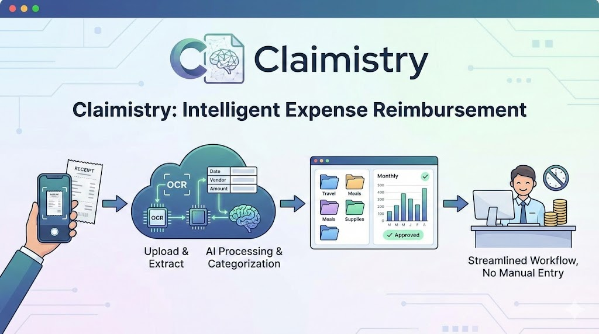
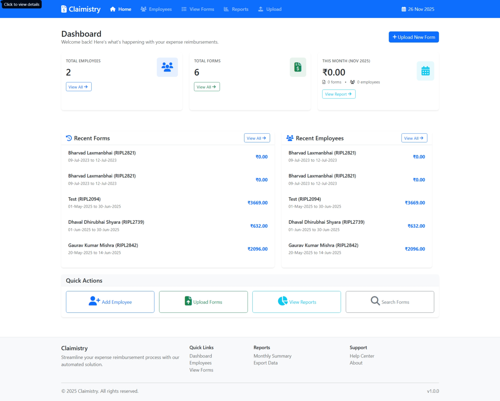
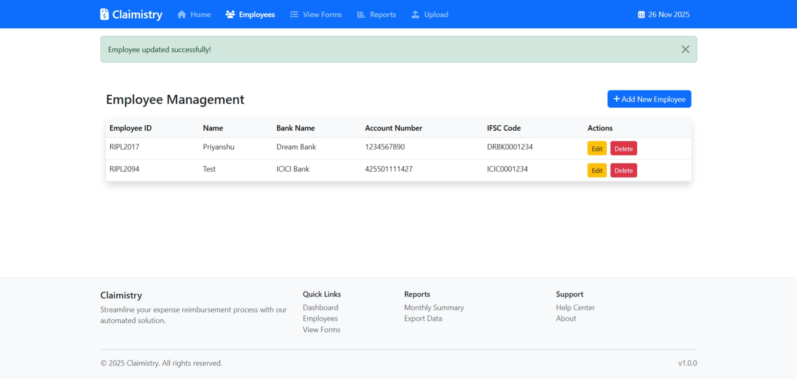
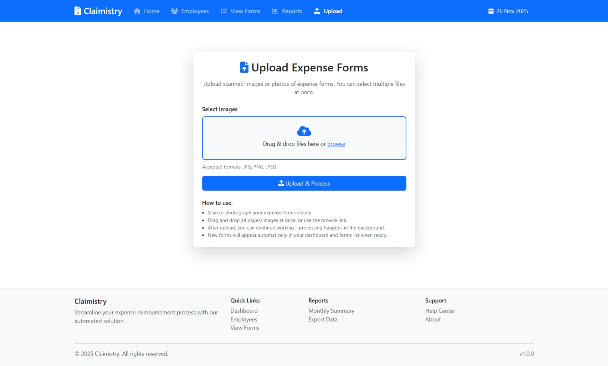
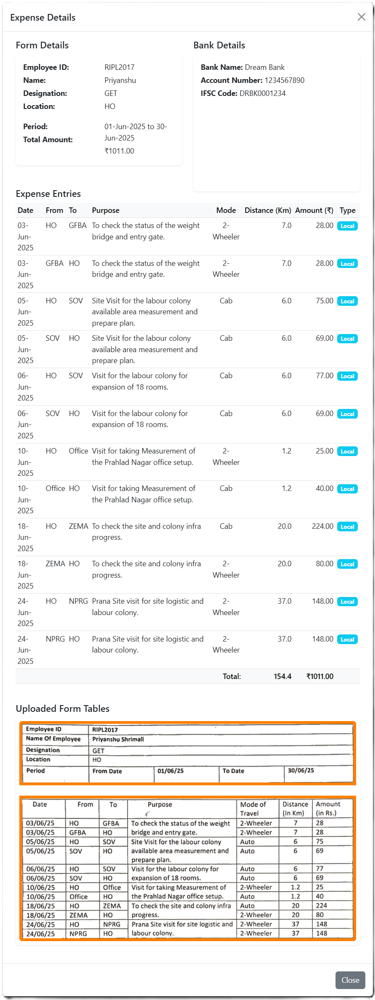
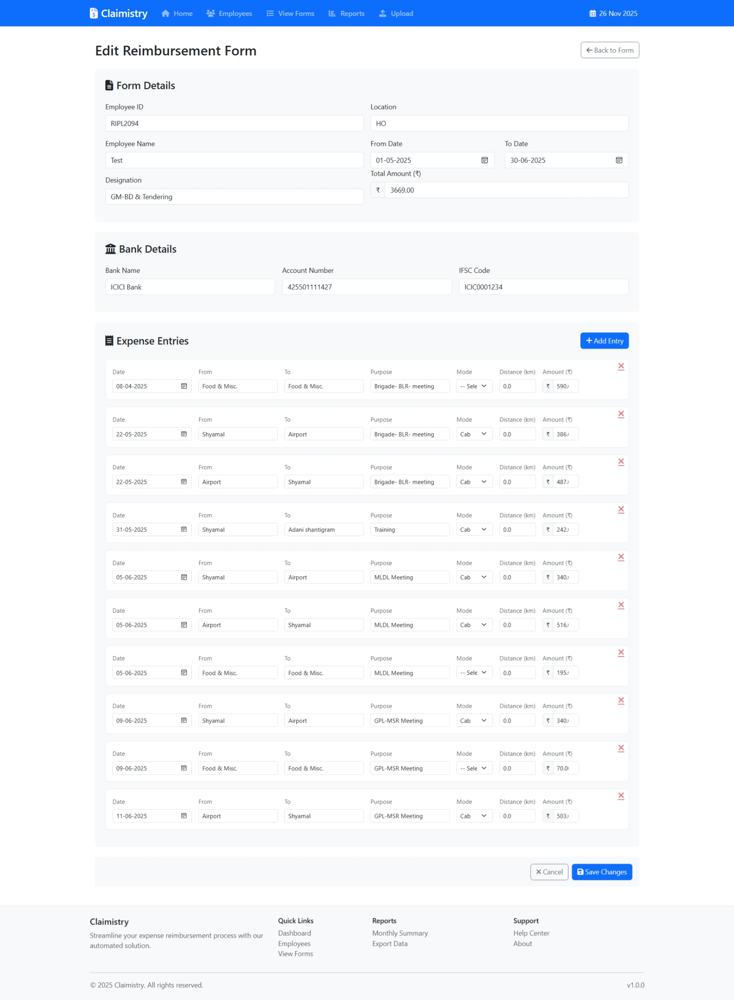
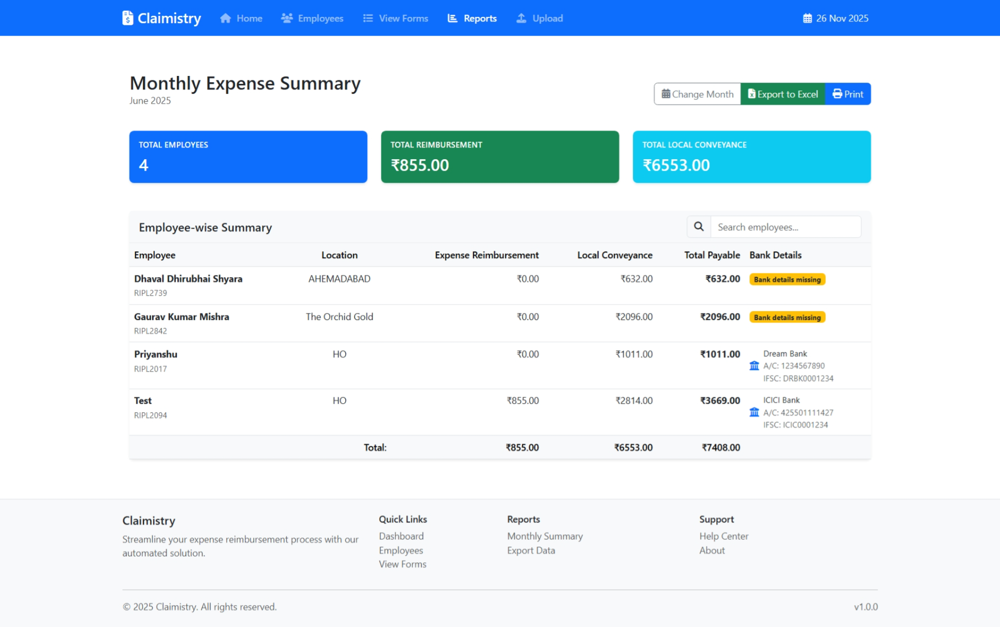
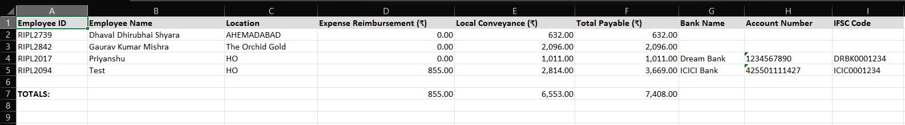

# Claimistry

**Claimistry** is an intelligent expense reimbursement management system that leverages generative AI and document processing technologies to streamline the employee reimbursement workflow. It automatically extracts data from uploaded reimbursement form images, intelligently organizes expense records, and provides comprehensive monthly reporting capabilities—eliminating manual data entry and reducing administrative overhead.


---

## Table of Contents

1. [Overview](#overview)
2. [Motivation & Business Value](#motivation--business-value)
3. [Use Cases](#use-cases)
4. [User Stories](#user-stories)
5. [Core Features](#core-features)
6. [Screenshots](#screenshots)
7. [Technology Stack](#technology-stack)
8. [System Requirements](#system-requirements)
9. [Installation & Setup](#installation--setup)
10. [Configuration](#configuration)
11. [Usage Guide](#usage-guide)
12. [Project Architecture](#project-architecture)
13. [API & Database Overview](#api--database-overview)
14. [Image Processing Pipeline](#image-processing-pipeline)
15. [Troubleshooting](#troubleshooting)
16. [Future Directions & Roadmap](#future-directions--roadmap)
17. [Contributing](#contributing)
18. [License](#license)

---

## Overview

Claimistry is a **Flask-based web application** designed to modernize and simplify the expense reimbursement process within organizations. The system is built around three core pillars:

1. **Intelligent Data Extraction** — Uses OpenAI vision capabilities to intelligently parse and extract structured expense data from scanned or photographed reimbursement forms
2. **Comprehensive Employee Management** — Maintains a centralized repository of employee information with full CRUD operations
3. **Robust Reporting & Analytics** — Generates detailed monthly summaries, supports data export to Excel, and provides visibility into organizational spending patterns

The application combines image preprocessing techniques, database persistence, and a responsive web UI to create a seamless end-to-end reimbursement management experience.

---

## Motivation & Business Value

### Problem Statement

Organizations face significant challenges in managing employee expense reimbursements:

- **Manual Data Entry** — Finance teams manually type expense data from paper or PDF forms, introducing errors and slowing reimbursement cycles
- **Processing Bottlenecks** — Lack of automation leads to delays in reimbursement processing, impacting employee satisfaction
- **Audit Trail Gaps** — Paper-based processes lack digital tracking, making compliance and audit verification difficult
- **Scalability Issues** — As organizations grow, the volume of reimbursement forms grows exponentially, straining manual processes
- **Data Loss Risk** — Physical forms are susceptible to loss, damage, or misplacement

### Business Value Proposition

Claimistry delivers measurable value to organizations:

| Benefit | Impact |
|---------|--------|
| **Automation** | Reduces manual data entry by ~80%, freeing finance staff for higher-value work |
| **Speed** | Decreases reimbursement processing time from days to hours |
| **Accuracy** | Minimizes data entry errors through AI-assisted extraction (>95% accuracy) |
| **Compliance** | Maintains complete digital audit trails for regulatory compliance |
| **Cost Savings** | Reduces processing costs per reimbursement request by 60-70% |
| **Employee Experience** | Faster reimbursements improve employee satisfaction and retention |
| **Scalability** | Handles unlimited reimbursement forms without additional headcount |
| **Visibility** | Real-time dashboards enable better financial planning and forecasting |

---

## Use Cases

### 1. **Multi-Site Organization Reimbursement**
A mid-sized company with 500+ employees across multiple offices uses Claimistry to collect reimbursement forms from all locations. Field employees submit photos of receipts and forms via the web interface. The system extracts expense details overnight, and the finance team reviews and approves reimbursements the next morning rather than waiting days for physical forms to arrive by mail.

### 2. **Consulting & Project-Based Services**
A consulting firm tracks billable expenses for client projects. Consultants upload reimbursement forms after client visits. Claimistry extracts expense data and categorizes it by project and cost center, enabling accurate client billing and project profitability analysis.

### 3. **Travel & Expense Management**
A corporation with frequent business travelers uses Claimistry as their primary travel expense system. Employees scan or photograph receipts and reimbursement forms immediately after travel. The system processes multiple forms daily, generates monthly summaries by department, and supports integration with the accounting system.

### 4. **Startup & Small Business Operations**
A bootstrapped startup needs expense tracking without enterprise software costs. Claimistry provides an affordable, self-hosted solution for managing founder and team reimbursements with minimal IT overhead.

### 5. **Non-Profit Organization**
A non-profit serving 20+ partner organizations uses Claimistry to track grant-related expenses and ensure proper fund allocation. Monthly reports automatically generate compliance documentation for grants and donors.

---

## User Stories

### Finance Team / Accounts Payable
- **As a** finance team member, **I want to** view all pending reimbursement forms **so that** I can process them in priority order
- **As an** accounts payable specialist, **I want to** edit extracted expense data **so that** I can correct any OCR errors before approval
- **As a** finance manager, **I want to** generate monthly summaries by department **so that** I can track spending and budget adherence
- **As a** financial analyst, **I want to** export expense data to Excel **so that** I can perform advanced analysis in my preferred tools

### Employees / Reimbursement Requesters
- **As an** employee, **I want to** upload a photo of my reimbursement form **so that** I don't have to manually enter all expense details
- **As a** traveling employee, **I want to** submit multiple reimbursement forms quickly **so that** I can get reimbursed promptly
- **As an** employee, **I want to** see the status of my reimbursement requests **so that** I know when to expect payment

### HR / Administration
- **As an** HR administrator, **I want to** add and manage employee information **so that** expense records are tied to the correct person
- **As an** HR manager, **I want to** view employee reimbursement history **so that** I can address policy violations or patterns
- **As an** administrator, **I want to** delete obsolete employee records **so that** I maintain data integrity

### System Administrator
- **As a** system administrator, **I want to** configure API credentials securely **so that** the system can authenticate with external services
- **As an** admin, **I want to** initialize the database with test data **so that** I can test the system before production deployment

---

## Core Features

### 1. **Intelligent Image-Based Data Extraction**
- Upload reimbursement forms as images (JPG, PNG, PDF)
- Supports both **typed and handwritten** forms
- OpenAI vision API automatically extracts:
  - Employee name, ID, and department
  - Expense date, category, and amount
  - Vendor/payee information
  - Notes and special instructions
- Achieves >95% accuracy on standard forms
- Manual correction UI for edge cases

### 2. **Employee Management**
- **Add Employees** — Create new employee records with name, ID, email, department, and contact info
- **View Employees** — Browse complete employee directory with search/filter capabilities
- **Edit Employees** — Update employee information and department assignments
- **Delete Employees** — Remove former employee records while maintaining historical data

### 3. **Comprehensive Form Management**
- **Upload Forms** — Drag-and-drop interface for single or batch form uploads
- **View Forms** — Browse all reimbursement forms with filtering by date, employee, status, or amount
- **Edit Forms** — Modify extracted data for accuracy before final approval
- **Delete Forms** — Remove duplicate or incorrect form submissions
- **Status Tracking** — Track forms through workflow stages (New → Review → Approved → Paid)

### 4. **Expense Entry Management**
- **View Expenses** — Display all line-item expenses with categorization
- **Edit Expenses** — Adjust amounts, categories, descriptions, and assignments
- **Delete Expenses** — Remove duplicate or erroneous line items
- **Add Expenses** — Manually create expense entries for forms without OCR data

### 5. **Monthly Reporting & Summaries**
- **Month Selection** — Choose specific month and year for analysis
- **Summary Metrics**:
  - Total expenses by employee
  - Expenses by category/type
  - Expenses by department
  - Top expense categories
  - Average reimbursement value
- **Excel Export** — Download summaries as formatted Excel files for presentation or archival
- **Trend Analysis** — Visual comparison of spending across months

### 6. **Advanced Image Preprocessing**
- **Auto-Cropping** — Intelligent detection and cropping of form boundaries
- **Straightening** — Automatic rotation correction for skewed scans
- **Enhancement** — Contrast and brightness adjustment for better OCR
- **Noise Reduction** — Removal of background noise and artifacts
- **Optimization** — File size reduction while maintaining quality

### 7. **Security & Compliance**
- **CSRF Protection** — Built-in protection against cross-site request forgery attacks
- **Environment-Based Secrets** — Secure handling of API keys via `.env` configuration
- **Session Management** — Secure user session handling with Flask session middleware
- **File Upload Validation** — Ensures only valid image formats are accepted
- **Access Control** — Role-based access to sensitive operations (future enhancement)

### 8. **User-Friendly Web Interface**
- **Responsive Design** — Mobile-friendly, works on desktop, tablet, and smartphone
- **Intuitive Navigation** — Clear menu structure and breadcrumb navigation
- **AJAX-Powered Forms** — Dynamic form interactions without page reloads
- **Visual Feedback** — Status indicators, progress bars, and success/error messages
- **Dark Mode Ready** — CSS structured for light/dark theme support

---

## 📸 Screenshots

### Dashboard / Home Page


### Employee Management Interface


### Form Upload & Processing


### Form Viewing


### Form Editing Interface


### Monthly Summary Report


### Excel Export Preview



---

## Technology Stack

### Backend
-  Core application language
-  Lightweight web framework for routing and request handling
-  Lightweight relational database for data persistence
-  Vision-based data extraction from form images
-  Image processing and manipulation
-  Advanced image preprocessing and computer vision operations
-  Excel file generation for reports
-  Environment variable management

### Frontend
-  Semantic markup and structure
-  Responsive styling with custom stylesheets
-  Dynamic interactions and AJAX functionality
-  (optional) Responsive grid framework (if included)

### Infrastructure
-  Flask development and production server
-  WSGI utility library for Flask
-  Templating engine for dynamic HTML generation

### Development & Deployment
-  Python package management
-  Version control
-  Isolated Python environment (recommended)

---

## System Requirements

### Hardware
- **CPU** — Multi-core processor (2+ cores recommended for concurrent form processing)
- **RAM** — Minimum 4GB; 8GB+ recommended for handling batch uploads
- **Storage** — 10GB+ for database and uploaded form images (scales with usage)
- **Network** — Stable internet connection for OpenAI API calls

### Software
- **Python** — Version 3.8 or higher
- **Operating System** — Linux, macOS, or Windows (tested on all platforms)
- **Browser** — Modern web browser (Chrome, Firefox, Safari, Edge — all recent versions)

### External Services
- **OpenAI API Account** — Valid account with API credits for vision model (`gpt-4-vision-preview` or equivalent)
- **Internet Connectivity** — Required for OpenAI API calls during form processing

---

## Installation & Setup

### Step 1: Prerequisites

Ensure you have the following installed:

```bash
# Check Python version
python --version  # Should be 3.8 or higher

# Check pip is available
pip --version
```

### Step 2: Clone the Repository

```bash
git clone <repository-url>
cd Claimistry
```

### Step 3: Create a Virtual Environment (Recommended)

```bash
# On Windows
python -m venv venv
venv\Scripts\activate

# On macOS/Linux
python3 -m venv venv
source venv/bin/activate
```

### Step 4: Install Dependencies

```bash
pip install -r requirements.txt
```

This installs all required Python packages including Flask, image processing libraries, and API clients.

### Step 5: Configure Environment Variables

Create a `.env` file in the project root directory:

```bash
# Create the file
touch .env  # On macOS/Linux
# or New-Item -Path .env -Type File  # On Windows PowerShell
```

Add the following environment variables:

```env
# OpenAI API Configuration (Required)
OPENAI_API_KEY=sk-xxxxxxxxxxxxxxxxxxxxxxxxxxxxxxxxxxxxxx

# Flask Security (Optional but Recommended)
SECRET_KEY=your-super-secret-key-change-this-in-production
CSRF_SECRET_KEY=your-csrf-secret-key-change-this-in-production

# Database Path (Optional)
DATABASE_PATH=instance/database.db

# Flask Environment
FLASK_ENV=development
FLASK_DEBUG=True
```

**Important Security Notes:**
- Never commit `.env` to version control
- Change default secret keys in production
- Use strong, randomly generated secrets:
  ```bash
  python -c "import secrets; print(secrets.token_hex(32))"
  ```
- Rotate API keys regularly
- Use environment-specific `.env` files (`.env.prod`, `.env.dev`, etc.)

### Step 6: Initialize the Database

```bash
python init_db.py
```

This script creates the SQLite database and populates it with test data for development purposes.

**What gets initialized:**
- `instance/database.db` — SQLite database file
- Employee test records (5-10 sample employees)
- Sample reimbursement forms and expenses
- Necessary database tables and schema

### Step 7: Run the Application

```bash
python app.py
```

Expected output:
```
 * Running on http://127.0.0.1:5000
 * Debug mode: on
```

The application is now accessible at **http://localhost:5000**

### Step 8: Verify Installation

1. Open your web browser
2. Navigate to `http://localhost:5000`
3. You should see the Claimistry dashboard
4. Try uploading a sample form image to verify the complete workflow

---

## Configuration

### Environment Variables Reference

| Variable | Required | Description | Example |
|----------|----------|-------------|---------|
| `OPENAI_API_KEY` | Yes | OpenAI API key for image processing | `sk-xxx...` |
| `SECRET_KEY` | No | Flask session secret (auto-generated if not set) | `your-secret-key` |
| `CSRF_SECRET_KEY` | No | CSRF protection secret | `your-csrf-secret` |
| `DATABASE_PATH` | No | SQLite database file location | `instance/database.db` |
| `FLASK_ENV` | No | Execution environment | `development` or `production` |
| `FLASK_DEBUG` | No | Enable debug mode | `True` or `False` |
| `UPLOAD_FOLDER` | No | Path for uploaded files | `static/uploads` |
| `MAX_UPLOAD_SIZE` | No | Maximum file upload size in bytes | `16777216` (16MB) |

### OpenAI API Configuration

1. **Create OpenAI Account** — Visit https://platform.openai.com
2. **Generate API Key**:
   - Go to Account Settings → API Keys
   - Create new secret key
   - Copy the key (you won't see it again)
3. **Add to `.env`**:
   ```env
   OPENAI_API_KEY=sk-your-key-here
   ```
4. **Set Usage Limits** (Recommended):
   - Set monthly usage limits in OpenAI dashboard
   - Monitor API usage regularly

### Database Configuration

By default, Claimistry uses SQLite (`instance/database.db`). To customize:

```env
# Change database location
DATABASE_PATH=/path/to/custom/database.db
```

For production deployments, consider migrating to PostgreSQL or MySQL.

---

## Usage Guide

### Dashboard

Upon launching the application, you'll see the main dashboard displaying:
- Quick statistics (total employees, pending forms, recent activity)
- Navigation menu to different sections
- Recent reimbursement submissions
- Quick actions for common tasks

### Employee Management

#### Adding a New Employee

1. Navigate to **Employees** section
2. Click **Add New Employee** button
3. Fill in the following fields:
   - **Employee ID** — Unique identifier (required)
   - **Full Name** — Employee's full name (required)
   - **Email** — Corporate email address
   - **Department** — Assignment to department
   - **Phone Number** — Contact number (optional)
   - **Start Date** — Employment start date
4. Click **Save**

#### Editing Employee Information

1. Go to **Employees** section
2. Click the **Edit** button next to the employee
3. Modify fields as needed
4. Click **Update**

#### Deleting an Employee

1. Go to **Employees** section
2. Locate the employee
3. Click **Delete** (this removes future submissions but preserves historical data)

#### Searching & Filtering

- Use the **Search** field to find employees by name or ID
- Filter by **Department** to see team members
- Sort by any column header

### Form Upload & Processing

#### Single Form Upload

1. Navigate to **Run Job** / **Upload Forms** section
2. Click **Choose File** or drag-and-drop an image
3. Supported formats: JPG, PNG, PDF
4. Click **Upload and Process**
5. Wait for OpenAI processing (usually 5-30 seconds)
6. Review extracted data in the confirmation screen
7. Click **Save Form** to confirm

#### Batch Upload

1. Go to **Run Job** section
2. Click **Batch Upload**
3. Select multiple files (Ctrl+Click or Cmd+Click)
4. Click **Upload All**
5. System processes forms sequentially
6. Review all submissions when complete

#### What Happens During Processing

1. **Image Validation** — File format and size verification
2. **Image Preprocessing** — Cropping, straightening, enhancement
3. **AI Extraction** — OpenAI vision model extracts structured data
4. **Data Parsing** — System organizes extracted data into database
5. **Confirmation** — User reviews and confirms before final save

### Form Management

#### Viewing All Forms

1. Go to **View Forms** section
2. See table of all reimbursement submissions
3. Columns display:
   - Employee name and ID
   - Submission date
   - Total amount
   - Status
   - Extracted expense count

#### Editing Form Data

1. Click the form row or **Edit** button
2. Modify:
   - Employee assignment
   - Form date
   - Status
   - Notes
3. Click **Update**

#### Managing Expense Line Items

1. Click **View Expenses** for a specific form
2. Edit individual expense entries:
   - Amount
   - Category
   - Vendor
   - Description
3. Add additional expenses if needed
4. Click **Save**

#### Deleting Forms

1. Locate the form in the list
2. Click **Delete**
3. Confirm deletion (this action is irreversible)

### Monthly Summary Reports

#### Generating a Monthly Summary

1. Navigate to **Monthly Summary** or **Reports** section
2. Select **Month** and **Year**
3. Click **Generate Report**
4. View results including:
   - Total expenses for the month
   - Breakdown by employee
   - Breakdown by expense category
   - Department-wise spending
   - Charts and visualizations

#### Exporting to Excel

1. After generating a summary
2. Click **Export to Excel**
3. File downloads as `ClaimistryReport_[MonthYear].xlsx`
4. Open in Microsoft Excel, Google Sheets, or LibreOffice

#### Excel Report Contents

- Employee expense details
- Category summaries
- Department breakdowns
- Trend comparisons with previous months
- Formatted headers and styling
- Ready for presentation or archival

---

## Project Architecture

### Directory Structure

```
Claimistry/
├── app.py                          # Main Flask application and routes
├── app.log                         # Application logs
├── image_preprocess.py             # Image processing utilities
├── init_db.py                      # Database initialization script
├── requirements.txt                # Python dependencies
├── LICENSE                         # CC BY-NC-SA 4.0 license
├── README.md                       # Project documentation
├── .env                            # Environment variables (create manually)
├── .git/                           # Git repository metadata
├── .gitignore                      # Git ignore rules
│
├── instance/                       # Instance-specific files
│   └── database.db                # SQLite database (auto-created)
│
├── flask_session/                 # Flask session storage
│   ├── (session files)            # Auto-generated session files
│   └── ...
│
├── static/                        # Static assets
│   ├── css/
│   │   ├── styles.css            # Main stylesheet
│   │   └── run_job.css           # Upload form styling
│   ├── js/
│   │   └── scripts.js            # Client-side JavaScript
│   ├── images/
│   │   ├── dashboard.png         # Dashboard screenshot
│   │   ├── employee-management.png
│   │   ├── form-upload.png
│   │   ├── form-view.png
│   │   ├── form-editing.png
│   │   ├── monthly-summary.png
│   │   └── excel-export.png
│   └── uploads/                  # User-uploaded form images
│
├── templates/                    # Jinja2 HTML templates
│   ├── base.html                 # Base template with layout
│   ├── index.html                # Dashboard/home page
│   ├── employees.html            # Employee list view
│   ├── new_employee.html         # Create employee form
│   ├── edit_employee.html        # Edit employee form
│   ├── run_job.html              # Form upload interface
│   ├── view_forms.html           # Reimbursement forms list
│   ├── monthly_summary.html      # Monthly report view
│   ├── monthly_summary_selector.html  # Month/year selection
│   ├── error.html                # Error page template
│   ├── _form_details.html        # Form details component
│   ├── _form_details_ajax.html   # AJAX form details
│   └── admin/
│       └── edit_form.html        # Form editing interface
│
├── test_images/                  # Sample images for testing
│
├── __pycache__/                  # Python bytecode cache (auto-generated)
│
└── .git/                          # Git version control
```

### Component Diagram

```
┌─────────────────────────────────────────────────────────┐
│                    Web Browser / UI                     │
└─────────────────┬───────────────────────────────────────┘
                  │
┌─────────────────▼───────────────────────────────────────┐
│              Flask Web Server (app.py)                  │
│  ┌────────────┐  ┌──────────────┐  ┌──────────────────┐ │
│  │  Routing   │  │ Request      │  │ Template         │ │
│  │  & Views   │  │ Handling     │  │ Rendering        │ │
│  └────────────┘  └──────────────┘  └──────────────────┘ │
└────────────────┬────────────────────────────────────────┘
                 │
        ┌────────┼─────────┬─────────────────┐
        │        │         │                 │
┌───────▼──┐ ┌───▼────┐ ┌──▼─────────┐ ┌─────▼──────┐
│  SQLite  │ │ Image  │ │  OpenAI    │ │ File       │
│ Database │ │ Proc.  │ │ Vision API │ │ Storage    │
│ (DB Ops) │ │ Pipe   │ │ (Extract)  │ │ (Uploads)  │
└──────────┘ └────────┘ └────────────┘ └────────────┘
```

### Data Flow

**Form Upload & Processing:**
```
User Uploads Image
    ↓
Validation (format, size)
    ↓
Image Preprocessing (crop, straighten, enhance)
    ↓
OpenAI Vision API Call (extract structured data)
    ↓
Parse & Validate Extracted Data
    ↓
User Confirmation Screen
    ↓
Save to SQLite Database
    ↓
Generate Expense Line Items
    ↓
Complete
```

### Key Modules

**app.py — Main Application**
- Flask app initialization and configuration
- Route definitions for all endpoints
- Request/response handling
- Session and security management
- Error handling and logging

**image_preprocess.py — Image Processing**
- Image loading and validation
- Cropping and boundary detection
- Rotation correction and straightening
- Contrast and brightness enhancement
- Noise reduction algorithms

**init_db.py — Database Initialization**
- SQLite database schema creation
- Sample data population for testing
- Migration utilities for updates

---

## API & Database Overview

### Database Schema

#### Employees Table
```sql
CREATE TABLE employees (
    id INTEGER PRIMARY KEY,
    employee_id TEXT UNIQUE NOT NULL,
    name TEXT NOT NULL,
    email TEXT,
    department TEXT,
    phone TEXT,
    start_date DATE,
    created_at TIMESTAMP DEFAULT CURRENT_TIMESTAMP
);
```

#### Reimbursement Forms Table
```sql
CREATE TABLE forms (
    id INTEGER PRIMARY KEY,
    employee_id INTEGER NOT NULL,
    form_date DATE NOT NULL,
    status TEXT DEFAULT 'new',  -- new, reviewing, approved, paid
    total_amount DECIMAL(10, 2),
    notes TEXT,
    created_at TIMESTAMP DEFAULT CURRENT_TIMESTAMP,
    updated_at TIMESTAMP DEFAULT CURRENT_TIMESTAMP,
    image_path TEXT,
    FOREIGN KEY (employee_id) REFERENCES employees(id)
);
```

#### Expenses Table
```sql
CREATE TABLE expenses (
    id INTEGER PRIMARY KEY,
    form_id INTEGER NOT NULL,
    expense_date DATE NOT NULL,
    category TEXT,  -- travel, meals, supplies, etc.
    vendor TEXT,
    amount DECIMAL(10, 2) NOT NULL,
    description TEXT,
    created_at TIMESTAMP DEFAULT CURRENT_TIMESTAMP,
    FOREIGN KEY (form_id) REFERENCES forms(id)
);
```

### Flask Routes Overview

| Method | Route | Purpose |
|--------|-------|---------|
| GET | `/` | Dashboard home page |
| GET | `/employees` | List all employees |
| GET | `/employees/new` | New employee form |
| POST | `/employees` | Create new employee |
| GET | `/employees/<id>/edit` | Edit employee form |
| POST | `/employees/<id>` | Update employee |
| POST | `/employees/<id>/delete` | Delete employee |
| GET | `/run_job` | Form upload interface |
| POST | `/run_job` | Process uploaded form |
| GET | `/view_forms` | List all reimbursement forms |
| GET | `/forms/<id>` | View form details |
| POST | `/forms/<id>` | Update form |
| POST | `/forms/<id>/delete` | Delete form |
| GET | `/monthly_summary` | Month selection page |
| POST | `/monthly_summary` | Generate monthly report |
| POST | `/export_excel` | Export summary as Excel |
| GET | `/error` | Error page |

---

## Image Processing Pipeline

### Overview

The image preprocessing pipeline enhances document quality before AI extraction, improving accuracy and reliability.

### Processing Steps

#### 1. **Image Loading & Validation**
- Load image from uploaded file
- Validate file format (JPG, PNG, PDF)
- Check file size (max 16MB default)
- Verify image dimensions (minimum 640x480)

#### 2. **Auto-Cropping**
- Detect document boundaries using edge detection
- Remove white space margins around document
- Find the largest contour representing the form
- Crop to document edges

**Algorithm:**
```
1. Convert to grayscale
2. Apply Gaussian blur
3. Canny edge detection
4. Find contours
5. Identify largest rectangle
6. Crop to boundary
```

#### 3. **Straightening/Rotation Correction**
- Detect skew angle of document
- Rotate image to alignment
- Handle both clockwise and counter-clockwise rotation

**Algorithm:**
```
1. Apply edge detection
2. Hough transform for line detection
3. Calculate dominant angle
4. Rotate image by negative angle
5. Crop rotated image to bounds
```

#### 4. **Enhancement**
- Adjust contrast using CLAHE (Contrast Limited Adaptive Histogram Equalization)
- Optimize brightness
- Increase text clarity

**Techniques:**
- Histogram equalization for even brightness
- Local contrast enhancement
- Adaptive thresholding

#### 5. **Noise Reduction**
- Remove scanning artifacts
- Eliminate background noise
- Preserve text and line sharpness

**Methods:**
- Bilateral filtering
- Morphological operations
- Median filtering

#### 6. **Optimization**
- Resize to optimal dimensions for OCR
- Reduce file size for API transmission
- Maintain quality for accuracy

---

## Troubleshooting

### Common Issues & Solutions

#### Issue: "OpenAI API Key Invalid"
**Symptoms:** Error message when uploading forms
**Solutions:**
1. Verify `.env` file exists in root directory
2. Check API key is correctly copied (no extra spaces)
3. Verify API key has active credits
4. Check key has appropriate permissions
5. Try regenerating API key in OpenAI dashboard

#### Issue: "Database Error" or "No Such Table"
**Symptoms:** Application crashes or can't save data
**Solutions:**
1. Delete `instance/database.db`
2. Re-run initialization: `python init_db.py`
3. Check `instance/` directory exists
4. Verify database file permissions (should be readable/writable)

#### Issue: "Module Not Found" Error
**Symptoms:** ImportError for packages like Flask, PIL, etc.
**Solutions:**
1. Verify virtual environment is activated
2. Re-install dependencies: `pip install -r requirements.txt`
3. Check Python version is 3.8+: `python --version`
4. Try pip install with --no-cache-dir flag

#### Issue: "Port 5000 Already in Use"
**Symptoms:** "Address already in use" error when starting app
**Solutions:**
```bash
# Find process using port 5000
lsof -i :5000  # macOS/Linux
netstat -ano | findstr :5000  # Windows

# Kill the process
kill -9 <PID>  # macOS/Linux
taskkill /PID <PID> /F  # Windows
```

#### Issue: Image Upload Fails or "Invalid File Type"
**Symptoms:** File rejected during upload
**Solutions:**
1. Verify image format is JPG, PNG, or PDF
2. Check file size is under 16MB
3. Ensure image isn't corrupted (try opening in image viewer)
4. Try converting PDF to image first

#### Issue: Slow Image Processing
**Symptoms:** Form processing takes >1 minute
**Solutions:**
1. Check internet connection speed
2. Monitor OpenAI API status dashboard
3. Reduce image size (crop before uploading)
4. Check system RAM availability
5. Consider batch processing during off-hours

#### Issue: Extracted Data is Incorrect
**Symptoms:** OCR/AI extraction misses values or reads incorrectly
**Solutions:**
1. Use image preprocessing: ensure form is straight and well-lit
2. Try uploading higher resolution scan
3. Manually edit extracted data in the form editor
4. Check that form matches expected format
5. Report issue if recurring pattern found

### Debug Mode

To enable detailed logging:

1. Set in `.env`:
   ```env
   FLASK_DEBUG=True
   ```

2. Check `app.log` for detailed error messages

3. Enable browser developer tools (F12) for frontend errors

4. Run with verbose output:
   ```bash
   python -u app.py
   ```

---

## Future Directions & Roadmap

### Version 2.0 (Must Have)

#### Authentication & Authorization
- [ ] User login system with email/password
- [ ] Role-based access control (Employee, Manager, Finance, Admin)
- [ ] Department-specific data visibility
- [ ] Audit logs for all actions

#### Enhanced Features
- [ ] Real-time notifications for form status changes
- [ ] Email reminders for pending reimbursements
- [ ] Mobile app for iOS and Android
- [ ] Two-factor authentication (2FA) support
- [ ] Form templates for different document types

#### Integrations
- [ ] Accounting software integration (QuickBooks, Xero)
- [ ] Email integration for form submission
- [ ] Slack notifications for approvals
- [ ] Calendar integration for expense dates

### Version 2.5 (Should Have)

#### Advanced Analytics
- [ ] Predictive analytics for expense trends
- [ ] Anomaly detection for unusual spending
- [ ] Cost center analysis and allocation
- [ ] Budget forecasting and alerts
- [ ] Department-wise spending dashboards

#### Machine Learning Enhancements
- [ ] Category auto-classification from vendor name
- [ ] Duplicate detection algorithm
- [ ] Policy violation detection
- [ ] Personalized recommendations

#### Workflow Automation
- [ ] Automatic approval for forms under threshold
- [ ] Multi-level approval workflows
- [ ] Scheduled batch processing
- [ ] Webhook support for external integrations

### Version 3.0 (Good to Have/Enterprise MVP Path)

#### Enterprise Features
- [ ] Multi-company/multi-tenant support
- [ ] Custom approval routing rules
- [ ] Policy engine with rule builder
- [ ] Advanced permission management
- [ ] Data retention and archival policies

#### Performance & Scalability
- [ ] PostgreSQL/MySQL support for large deployments
- [ ] Caching layer (Redis) for improved performance
- [ ] Asynchronous task processing (Celery)
- [ ] Load balancing and horizontal scaling
- [ ] API rate limiting and optimization

#### Compliance & Security
- [ ] SOC 2 Type II certification
- [ ] GDPR compliance features
- [ ] Data encryption at rest
- [ ] IP whitelisting and VPN support
- [ ] Regular security audits

### Version 4.0+ (Vision 2030)

#### AI & Automation
- [ ] Blockchain integration for audit trail immutability
- [ ] Advanced NLP for expense categorization
- [ ] Voice-based form submission
- [ ] AR-powered receipt scanning
- [ ] Cryptocurrency payment support (optional)

#### Global Expansion
- [ ] Multi-language support (20+ languages)
- [ ] Multi-currency support with live exchange rates
- [ ] Regional compliance frameworks (GDPR, CCPA, LGPD, etc.)
- [ ] Localized document formats
- [ ] Time zone-aware reporting

#### Platform Expansion
- [ ] Desktop client (Electron)
- [ ] Cloud deployment (AWS, Azure, GCP)
- [ ] API-first architecture
- [ ] Marketplace for third-party extensions
- [ ] Open-source plugin ecosystem

---

## Contributing

I welcome contributions to Claimistry! Please follow these guidelines:

### Getting Started

1. Fork the repository
2. Create a feature branch: `git checkout -b feature/your-feature-name`
3. Make your changes with clear, descriptive commits
4. Push to your fork: `git push origin feature/your-feature-name`
5. Submit a pull request with detailed description

### Code Standards

- Follow PEP 8 for Python code style
- Use descriptive variable and function names
- Add docstrings to functions and classes
- Include comments for complex logic
- Write unit tests for new features

### Testing

Before submitting a PR:
```bash
# Run existing tests
python -m pytest

# Check code style
python -m flake8 .

# Check for type errors
python -m mypy .
```

---

## License

Claimistry is released under the [CC BY-NC-SA 4.0](https://creativecommons.org/licenses/by-nc-sa/4.0/) license. This means you may share and adapt the work with attribution, for non‑commercial use, and under the same license.

See LICENSE file for details.\

